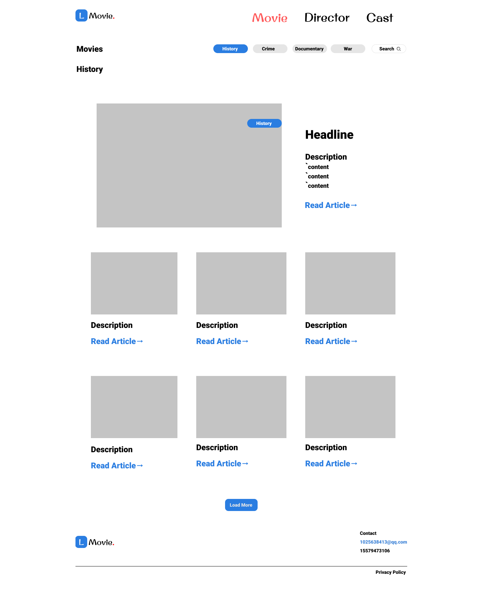
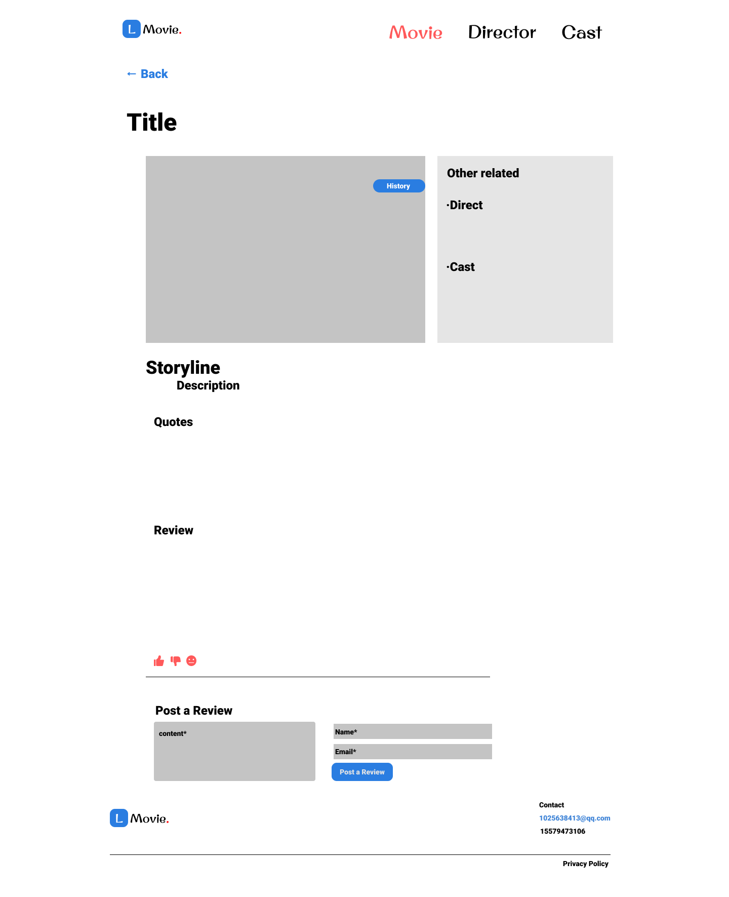

# 电影日志
## Github页面部署：nathanlilxx.github.io
## 一、网站说明
### 1. 登陆权限
- 查看“电影集”及“影评集”不需要登录标识
- “创建”功能需要登录标识
  - 账号：123 密码：123
  - cookie设置登录标识符（有效期一小时）
### 2. 功能开发
- “电影集”网页展示电影列表
  - 电影列表中的数据由“创建”功能生成
    - 数据采用本地存储（local storage）
    - 页面元素的动态增删改由DOM API 实现
  - “筛选电影”按钮根据电影类型动态展示电影列表
    
- “影评集”网页展示影评列表
  - 影评部分为静态页面，仅实现<b>字段展示</b>及<b>响应式功能</b> 
## 二、网站内容
### 1、结构类型
  - 电影
    - 电影名
    - 电影照片
    - 电影类型
    - 电影评分
    - 电影梗概
    - 上映日期

  
  - 影评
    - 文章标题
    - 文章封面
    - 文章作者
    - 发布日期
    - 文章正文
    - 关联电影
    - 帮助度

### 2、个人特色
#### 组织电影内容与影评信息，快捷获得观影推荐

参考网站：[IMDB](https://www.imdb.com/) [IGN](https://www.imdb.com/)
### 3、基本界面
（早期模型图：与当前搭建版本字段结构大致相同，但布局更改）
- 页面类型模板
  
- 内容类型模板
  

