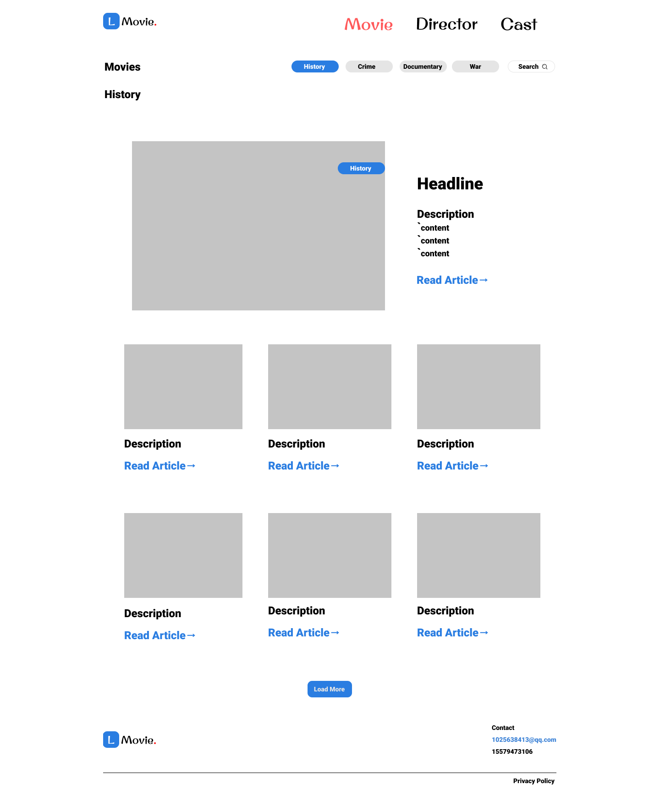

# 电影日志
## Github页面部署：nathanlilxx.github.io/movies
## 网站内容
### 一、结构类型
  - 电影
    - 电影名
    - 电影照片
    - 电影类型
    - 电影评分
    - 电影梗概
    - 上映日期
    - 关联评测
  
  - 影评
    - 文章标题
    - 文章封面
    - 文章作者
    - 发布日期
    - 文章正文
    - 关联电影
    - 帮助度

### 二、个人特色
#### 组织电影内容与影评信息，快捷获得观影推荐

参考网站：[IMDB](https://www.imdb.com/) [IGN](https://www.imdb.com/)
### 三、基本界面

- 页面类型模板
  
- 内容类型模板
  

